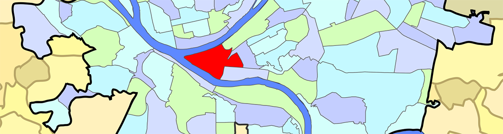
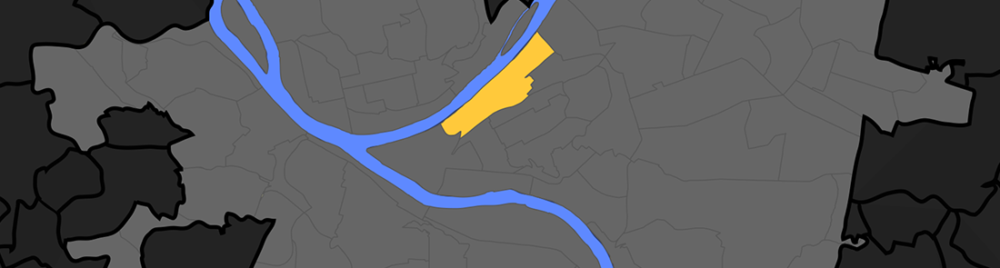
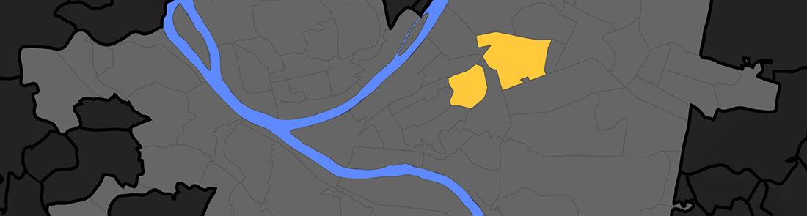

## Welcome to Pittsburgh! We're excited for you to explore our amazing city during #MCN2017. Since most city guides leave much to be desired in the areas of personality and authenticity, we yinzers (a.k.a. Pittsburghers) on the local host committee have created this handy guide for MCN 2017!

### General Information

If you're staying at/near the conference hotel downtown, many restaurants and attractions will be within walking distance. If you're staying in another neighborhood, Pittsburgh's [bike share program](https://healthyridepgh.com) can get you around, along with the standard Uber/Lyft options. Regular taxi service, like hailing a cab, generally doesn't work.

A great introduction to the city is [Rick Seback's](http://www.twitter.com/rickaroundhere) *It's Pittsburgh, and a Lot of Other Stuff* video series, which you can stream [here](http://www.wqed.org/tv/watch/?series=3) via our local PBS affiliate, WQED. This guy is a Pittsburgh treasure.

We like to put french fries on a bunch of things, ranging from salads to [signature sandwiches](https://en.wikipedia.org/wiki/Primanti_Brothers). It's OK. Just let it happen. There are many other things that make this city charming and special, some of which include [the dialect](https://en.wikipedia.org/wiki/Western_Pennsylvania_English), [family traditions](https://en.wikipedia.org/wiki/Cookie_table) and affinity for [the city's official colors](https://www.youtube.com/watch?v=UePtoxDhJSw).

Pittsburgh is best described as a city that's made up of distinct and vibrant neighborhoods, which are defined largely by the region's prominent topography. A curated list of several of these neighborhoods and their respective attractions are highlighted below.

### Downtown (Cultural District)

Downtown Pittsburgh, colloquially referred to as the Golden Triangle or *Dahntahn* in Pittsburghese, and officially the Central Business District, is the urban downtown center of Pittsburgh. It is located at the confluence of the Allegheny River and the Monongahela River whose joining forms the Ohio River. The "triangle" is bounded by the two rivers.

#### Food & Drink:
* Bakersfield (Tacos, tequila and whiskey) [website](http://www.bakersfieldtacos.com/) | [yelp](https://www.yelp.com/biz/bakersfield-penn-ave-pittsburgh) | [directions](https://goo.gl/maps/EpQx4Dxf9qz)
* Meat and Potatoes (Modern gastropub w/ great brunch) [website](http://meatandpotatoespgh.com/) | [yelp](https://www.yelp.com/biz/meat-and-potatoes-pittsburgh) | [directions](https://goo.gl/maps/GCPgwnbi3PB2)
* Nicky's Thai Kitchen (Seriously tasty Thai) [website](http://www.nickysthaikitchen.com/) | [yelp](http://www.yelp.com/biz/nickys-thai-kitchen-pittsburgh-4) | [directions](https://goo.gl/maps/seogX)
* Sharp Edge (Fantastic beer selection) [website](http://sharpedgebeer.com/bistro-on-penn) | [yelp](http://www.yelp.com/biz/bistro-penn-pittsburgh-4) | [directions](https://goo.gl/maps/bAXLo)
* Sienna Mercato (Meatballs!) [website](http://www.siennapgh.com/mercato/) | [yelp](http://www.yelp.com/biz/sienna-mercato-pittsburgh) | [directions](https://goo.gl/maps/odkPP)
* Ten Penny (Classy casual spot for drinks & apps) [website](http://www.tenpennypgh.com/) | [yelp](http://www.yelp.com/biz/ten-penny-pittsburgh) | [directions](https://goo.gl/maps/JJRbw)

#### Sights & Miscellany:
* Arcade Comedy Theater (Best place in town to see live comedy) [website](http://arcadecomedytheater.com/) | [yelp](https://www.yelp.com/biz/arcade-comedy-theater-pittsburgh) | [directions](https://goo.gl/maps/mfVeVSQhGXD2)
* Harris Theater (Indie films & documentaries) [website](https://trustarts.org/pct_home/visit/facilities/harris-theater/) | [directions](https://goo.gl/maps/iExh6KsVrGE2)
* Market Square (Pittsburgh's traditional public square) [website](http://marketsquarepgh.com/) | [directions](https://goo.gl/maps/KNepZvewL8A2)
* Point State Park (The confluence of 3 rivers) [website](http://www.dcnr.state.pa.us/stateparks/findapark/point/) | [directions](https://goo.gl/maps/VzCSpcTFoPR2)

### Strip District

The Strip is an excellent place to explore on foot. It's where Pittsburgh goes to get...pretty much anything. Steelers shirt? Yep. Random imported Italian cheese? Got it. Cannoli? Boom. Mung bean pancakes? Got you covered. Come hungry.

#### Food & Drink:
* Gaucho (Wood-fired delights with an Argentine flare) [website](http://eatgaucho.com/) | [yelp](http://www.yelp.com/biz/gaucho-parrilla-argentina-pittsburgh) | [directions](https://goo.gl/maps/hE6XU)
* Pamela's (The PGH Breakfast. Note: cash only, but there's an ATM) [website](http://www.pamelasdiner.com/) | [yelp](http://www.yelp.com/biz/pamelas-p-and-g-diner-pittsburgh) | [directions](https://goo.gl/maps/iY445)
* Primanti Brothers (The original fries-on-sandwich thing) [website](https://www.primantibros.com/) | [yelp](http://www.yelp.com/biz/primanti-brothers-pittsburgh) | [directions](https://goo.gl/maps/KbHFL)
* Enrico Biscotti (specialty coffee) [website](http://www.enricobiscotti.com/) | [yelp](http://www.yelp.com/biz/the-enrico-biscotti-co-pittsburgh)  | [directions](https://goo.gl/maps/vcHjk)
* 21st Street (specialty coffee) [website](http://21streetcoffee.com/) | [yelp](http://www.yelp.com/biz/21st-street-coffee-and-tea-pittsburgh)
* Salem's Grill and Market (Note: closed from 1-2 on Friday for prayers): [yelp](http://www.yelp.com/biz/salems-market-and-grill-pittsburgh) | [directions](https://goo.gl/maps/XagDH)
* Smallman Galley (Indie Restaurant incubator) [website](http://www.smallmangalley.org/) | [yelp](http://www.yelp.com/biz/smallman-galley-pittsburgh-2) | [directions](https://www.google.com/maps/dir//galley+kitchen+pittsburgh/@40.4519361,-80.0540342,12z/data=!3m1!4b1!4m8!4m7!1m0!1m5!1m1!1s0x8834f3dd3cda6335:0xc95198a984cbf75d!2m2!1d-79.9839935!2d40.4519572)

#### Sights & Miscellany:
* Eide's (Fantastic selection of new & used records, memorabilia and collectables) [website](http://www.eides.com/) | [directions](https://goo.gl/maps/ebrJJnQGF6B2)
* Yinzers (Sports wear & Pittsburgh-themed memorabilia) [yelp](http://www.yelp.com/biz/yinzers-pittsburgh) | [directions](https://goo.gl/maps/EDwRI)
* Senator John Heinz History Center (museum): [website](http://www.heinzhistorycenter.org/) | [directions](https://goo.gl/maps/nGEJJ)

### North Side

Pittsburgh's North Side is located to the north of the Allegheny and Ohio Rivers. The term "North Side" does not refer to a specific neighborhood, but rather to a disparate collection of contiguous neighborhoods. It's the home many fantastic cultural destinations, eateries and sports venues.

#### Food & Drink:
* El Burro (Vegetarian- & vegan-friendly taco stand) [website](http://www.elburropgh.com/) | [yelp](http://www.yelp.com/biz/el-burro-pittsburgh) | [directions](https://goo.gl/maps/Qz9Jx)
* Nicky's Thai Kitchen (Tasty Thai) [website](http://www.nickysthaikitchen.com/) | [yelp](http://www.yelp.com/biz/nickys-thai-kitchen-pittsburgh) | [directions](https://goo.gl/maps/HRgzB)
* Max's Allegheny Tavern (Authentic German) [website](http://www.maxsalleghenytavern.com/) | [yelp](http://www.yelp.com/biz/maxs-allegheny-tavern-pittsburgh) | [directions](https://www.google.com/maps/place/Max's+Allegheny+Tavern/@40.4551832,-79.9997423,15z/data=!4m2!3m1!1s0x0:0x76b38e8bd490e8ab)
* Monterey Pub (Neighborhood Irish pub) [website](http://www.montereypub.com/) | [yelp](https://www.yelp.com/biz/monterey-pub-pittsburgh) | [directions](https://goo.gl/maps/vur1E1CJdm62)
* Penn Brewery (Pittsburgh's oldest & largest brewery) [website](http://www.pennbrew.com/) | [yelp](https://www.yelp.com/biz/penn-brewery-pittsburgh) | [directions](https://goo.gl/maps/eybAwDu8Vr72)

#### Sights & Miscellany:
* Andy Warhol Museum [website](http://www.warhol.org/) | [directions](https://goo.gl/maps/bIal0)
* Mattress Factory (Museum of contemporary installation art) [website](http://www.mattress.org/) | [directions](https://goo.gl/maps/I8VO4)
* Pittsburgh Children's Museum [website](https://pittsburghkids.org/) |  [directions](https://goo.gl/maps/5NPtf)
* Pittsburgh Banjo Club (Wednesdays 8-11pm at the Elks Lodge #339) [website](https://www.thepittsburghbanjoclub.com/wednesday) | [directions](https://goo.gl/maps/oNVx39svdSQ2)
* Randyland (North Side folk/public art house) [website](http://randy.land/) | [direction](https://goo.gl/maps/NmtZ8W5aUvF2)
* St. Anthony's Chapel (A unique and somewhat weird collection of relics off the beaten path) [website](http://saintanthonyschapel.org/) | [directions](https://goo.gl/maps/8zWQG)

### South Side

South Side is an area located along the Monongahela River across from Downtown Pittsburgh. The South Side is officially divided into two neighborhoods, South Side Flats and South Side Slopes, and is well-connected with public transit.

#### Food & Drink:
* Amazing Cafe (vegetarian / vegan, juice, smoothies) [website](http://www.amazingyoga.net/cafe/) | [yelp](http://www.yelp.com/biz/amazing-cafe-pittsburgh)
* Dee's Cafe (PGH's 2nd best dive bar. Note: smoking permitted) [website](http://www.deescafe.com/) | [yelp](https://www.yelp.com/biz/dees-cafe-pittsburgh) | [directions](https://goo.gl/maps/RopQhADchrB2)
* Onion Maiden (Punk rock-fueled, heavy metal-spawned food purveyer) [website](https://www.onionmaiden.com)  |  [yelp](https://www.yelp.com/biz/onion-maiden-pittsburgh)  |  [directions](https://goo.gl/maps/uTG3QzJKSPU2)
* The Smiling Moose (rock and roll bar with a surprisingly good menu) [website](http://www.smiling-moose.com/) | [yelp](http://www.yelp.com/biz/the-smiling-moose-pittsburgh)
* The Pub Chip Shop (heavy Scottish fare) [website](http://thepubchipshop.com/) | [yelp](http://www.yelp.com/biz/the-pub-chip-shop-pittsburgh)
* Winghart's (burgers & whiskey) [website](http://www.winghartburgers.com/) | [yelp](http://www.yelp.com/biz/wingharts-burger-and-whiskey-bar-pittsburgh-2)
* The Beehive (neighborhood institution serving coffee & sandwiches) [website](http://www.beehivebuzz.com/)
* The Pretzel Shop (The best pretzels ever) [website](http://www.thepretzelshop.net/) | [yelp](http://www.yelp.com/biz/the-pretzel-shop-pittsburgh) | [directions](https://goo.gl/maps/1kEpSmKmHMm)
* Piper's Pub (Pub food, and a great brunch) [site](http://www.piperspub.com/) | [yelp](http://www.yelp.com/biz/pipers-pub-pittsburgh) | [directions](https://goo.gl/maps/2NTqfY2ffTP2)

### Mount Washington

Really, the best thing about Mount Washington is the amazing view of the city. Ride one of the two inclines to get to Grandview Avenue!

* [Duquesne Incline - Lower Station](https://goo.gl/maps/20JP7)
* [Mon Incline - Lower Station](https://goo.gl/maps/NfqRJ)

### Polish Hill

Polish Hill is a working-class neighborhood, just above the Strip District. It's home to artists and creatives, and there's a nice mix of younger and O.G. yinzers to be found here.

#### Food & Drink
* Church Brew Works (Church-turned-brewery w/ great menu) [yelp](https://www.yelp.com/biz/church-brew-works-pittsburgh) | [directions](https://goo.gl/maps/yVgzUSU4Pq82)
* Gooski's (PGH's best dive bar & Tulo's favorite. Note: cash only and smoking permitted) [yelp](https://www.yelp.com/biz/gooskis-pittsburgh) | [directions](https://goo.gl/maps/8r1wZA4z1i92)
* Rock Room (Another Polish Hill dive) [yelp](https://www.yelp.com/biz/rock-room-pittsburgh) | [directions](https://goo.gl/maps/UUxguQELJKB2)

#### Sights & Miscellany
* Cruel Noise Records (Great selection of indie/punk/hardcore/metal vinyl & tape) [website](https://www.cruelnoiserecords.com/) | [directions](https://goo.gl/maps/A2YMnaRKEAy)

### Lawrenceville

Lawrenceville is kind of like the Williamsburg (Brooklyn) of Pittsburgh. Lots of hipsters and young professionals, but some definite gems for eating, drinking and nightlife.

#### Food & Drink:
* Espresso a Mano (coffee) [website](http://espressoamano.com/) | [yelp](http://www.yelp.com/biz/espresso-a-mano-pittsburgh) | [directions](https://goo.gl/maps/xpDCk)
* Cure (artisan meat) [website](http://www.curepittsburgh.com/#welcome-to-cure) | [yelp](http://www.yelp.com/biz/cure-pittsburgh)
* Frankie's (cheap hot dogs, been around since the dawn of time. Follow the onions.) | [yelp](http://www.yelp.com/biz/frankies-extra-long-pittsburgh) | [directions](https://goo.gl/maps/iYhMd)
* Pusadee's Garden (Thai) [site](http://www.pusadeesgarden.com/) | [yelp](http://www.yelp.com/biz/pusadees-garden-pittsburgh)
* Round Corner Cantina (Mexican cocktails and bar food) [website](http://roundcornercantina.com/) | [yelp](http://www.yelp.com/biz/round-corner-cantina-pittsburgh)
* Smoke BBQ Taqueria (Barbecue tacos. What's not to like? BYOB. Cash only, but there's an ATM onsite.) [yelp](http://www.yelp.com/biz/smoke-bbq-taqueria-pittsburgh) | [directions](https://goo.gl/maps/C8Uk6)
* Spirit (Pizzeria, bar and event hall) [website](http://www.spiritpgh.com/) | [yelp](https://www.yelp.com/biz/spirit-lodge-pittsburgh-2) | [directions](https://goo.gl/maps/GdJYsivSN8o)
* Tender (artisan cocktails) [website](http://tenderpgh.com/) | [yelp](http://www.yelp.com/biz/tender-bar-and-kitchen-pittsburgh-2)
* The Vandal [website](http://www.thevandalpgh.com/) | [yelp](http://www.yelp.com/biz/the-vandal-pittsburgh)
* Butterwood Bake Consortium (baked goods, cake, coffee, Vegan/Veg friendly.) [website](https://www.thebutterwoodbakeconsortium.com/) | [yelp](https://www.yelp.com/biz/the-butterwood-bake-consortium-pittsburgh)
* Ki Ramen (Ramen. Try the bao buns! Vegan/Veg friendly) | [website](http://kiramenpgh.com/) | [yelp](https://www.yelp.com/biz/ki-ramen-pittsburgh)

#### Sights & Miscellany:
* Backstage Guitars (Vintage guitars and analog amps/effects) [website](http://backstageguitars.com/) | [directions](https://goo.gl/maps/SdrkofyNiHF2)
* Row House Cinema (Indie movie theater) [website](http://rowhousecinema.com) | [directions](https://goo.gl/maps/ktYgcnx6ygG2)

### East Liberty / Shadyside

#### Food & Drink:
* Ace Hotel / The Whitfield (hotel + bar + restaurant) [website](https://www.acehotel.com/pittsburgh) | [yelp](http://www.yelp.com/biz/ace-hotel-pittsburgh-pittsburgh)
* The Livermore (restaurant + bar) [website](http://www.thelivermorepgh.com/) | [yelp](http://www.yelp.com/biz/the-livermore-pittsburgh)
* Dinette (pizza) [website](http://dinette-pgh.com/) | [yelp](http://www.yelp.com/biz/dinette-pittsburgh)
* Pizza Taglio (pizza) [facebook](https://www.facebook.com/tagliopgh/) | [yelp](http://www.yelp.com/biz/pizza-taglio-pittsburgh-2)
* Kelly's (cocktail bar, get the mac & cheese) [yelp](http://www.yelp.com/biz/kellys-bar-and-lounge-pittsburgh-2)
* Mad Mex (Americanized Tex-Mex comfort food, good for groups): [website](http://www.madmex.com/pittsburgh/shadyside) | [yelp](http://www.yelp.com/biz/mad-mex-shadyside-pittsburgh)
* Social (bar so big that it's easily mistaken for an airplane hanger): [website](http://www.bakerysocial.com/) | [yelp](http://www.yelp.com/biz/social-pittsburgh)

#### Sights & Miscellany:
* East Liberty Presbyterian (huge historic church, worth wandering into) [website](http://cathedralofhope.org/)

### Oakland

Oakland is really a student haven, and where you can find the University of Pittsburgh and Carnegie Mellon University. The main attractions here are some awesome museums and great parks. Parking can be a challenge, so pay close attention to where you're parking and how much it will cost.

#### Food & Drink
* Ali Baba (Long-standing, since 1972, eatery serving authentic Middle Eastern dishes in a relaxed setting.) [yelp](https://www.yelp.com/biz/ali-baba-pittsburgh)  |  [directions](https://goo.gl/maps/tDPHZfyxC612)
* Cafe Carnegie (Upscale museum dining) [website](http://thecafecarnegie.com)  |  [yelp](https://www.yelp.com/biz/the-café-carnegie-pittsburgh)  |  [directions](https://goo.gl/maps/SZQUL4G8HnL2)
* Fuel and Fuddle (Great for late night comfort food) [website](http://fuelandfuddle.com/) | [yelp](https://www.yelp.com/biz/fuel-and-fuddle-pittsburgh) | [directions](https://goo.gl/maps/hQg6fXZ74B22)
* The Porch (On Schenley Plaza) [website](http://www.theporchatschenley.com/) | [yelp](https://www.yelp.com/biz/the-porch-at-schenley-pittsburgh) | [directions](https://goo.gl/maps/YPiiQLqEppw)
* Union Grill (A Pittsburgh landmark, right between Pitt & CMU) [website](https://www.uniongrillpittsburgh.com/) | [yelp](https://www.yelp.com/biz/union-grill-pittsburgh) | [directions](https://goo.gl/maps/hjqzQsqqDA52)

#### Sights & Miscellany
* Carnegie Museums of Art and Natural History (two museums in one building) [CMOA site](http://www.cmoa.org) // [CMNH site](www.http://www.carnegiemnh.org/) | [directions](https://goo.gl/maps/xAUTRffyGzx)
* Phipps Conservatory and Botanical Gardens [website](https://www.phipps.conservatory.org/)  |  [directions](https://goo.gl/maps/St6xwbi5RHF2)
